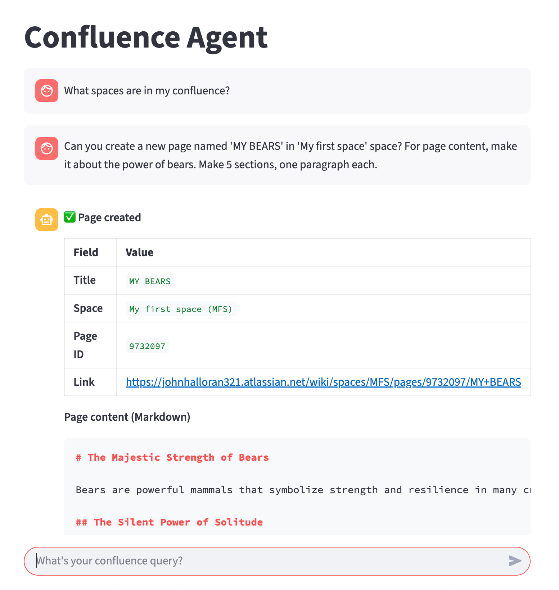
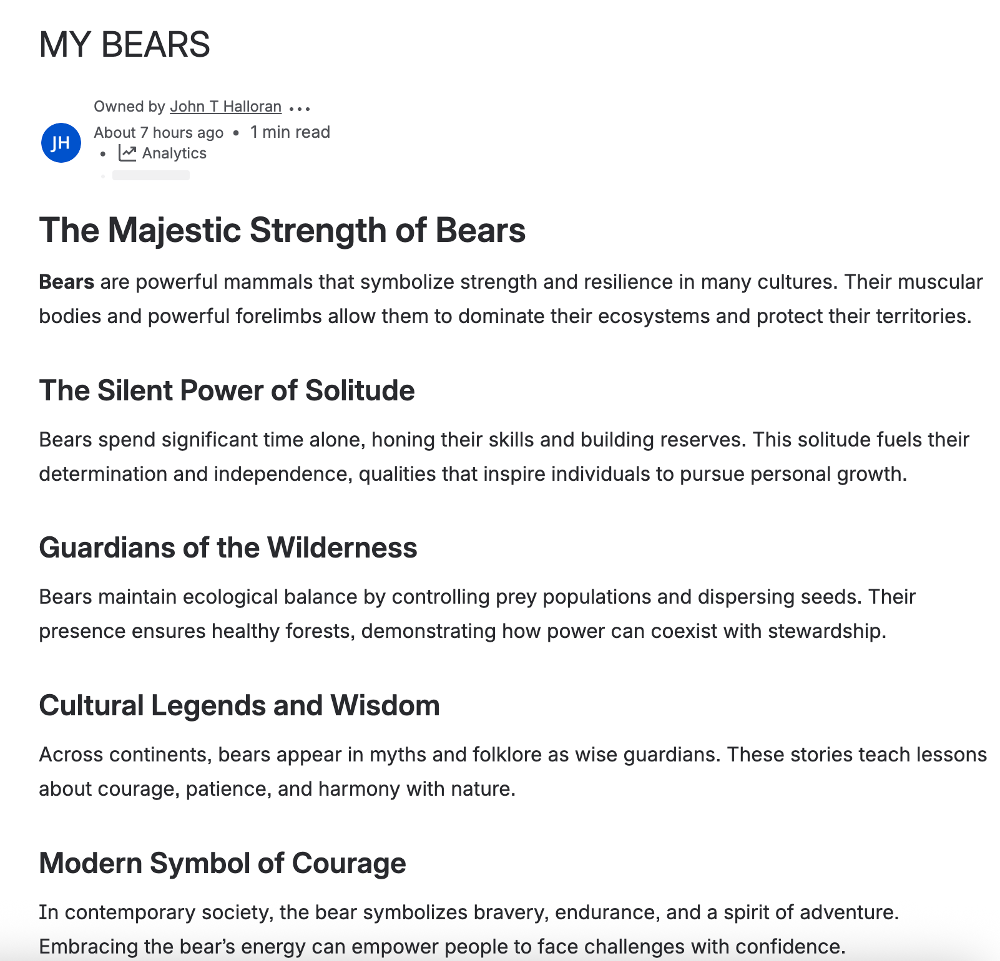

# Atlassian Agent
<p align="center">
   
</p>

## About

A local (gpt-oss-20b) agentic solution providing full integration with the [official Atlassian MCP server](https://www.atlassian.com/blog/announcements/remote-mcp-server).  Heavy lifting by [Agno](https://github.com/agno-agi/agno]).

## Installation

    git clone https://github.com/johnhalloran321/atlassian-agent
    cd atlassian-agent
    pip install -r requirements.txt

## Prereqs before use
If gpt-oss-20b for ollama has not been downloaded, pull the model using

     ollama pull gpt-oss:20b

If using `conda` and `npx` is not installed, run 

    conda install conda-forge::nodejs

## Example use
In a standalone terminal, run the following command and leave the terminal open:

    npx -y mcp-remote https://mcp.atlassian.com/v1/sse

Start the ollama server in a separate terminal:

    ollama serve


In a separate terminal, start the chat session by running:

    streamlit run atlassian_agent.py

### Chat example
An example request, with specific instructions about writing a Confluence page about bears:


and the resulting confluence page:


## Troubleshooting
The software requires `python >= 3.11`.

## Citation
If you use this code in your work or research, please cite:

```bibtex
@article{halloran2025atlassian,
  title={GPT-OSS Powered Agent Integrated with the Official Atlassian MCP server},
  author={Halloran, John},
  howpublished={\url{https://github.com/johnhalloran321/atlassian-agent}},
  date = {2025-01-25},  
}
```